## Linux essentials-Task 1


I started by running a Docker container with an Ubuntu image, as required. This allows me to execute all tasks in an isolated environment without affecting my host system.
I used the suggested command to start the container: 

 ```
 docker run -it ubuntu 
 ``` 

 - #### Lookup the Public IP of cloudflare.com

 To retrieve the public IP address of cloudflare.com, I used the nslookup command. However, since nslookup is not included by default in the Ubuntu container, I first had to install the dnsutils package.

 For installing the package, I ran the following command :
 ``` 
 apt update && apt install -y dnsutils
 ```
 Once installed, I used the following command to get the public IP:
 ``` 
 nslookup cloudflare.com
 ```
 Output:


 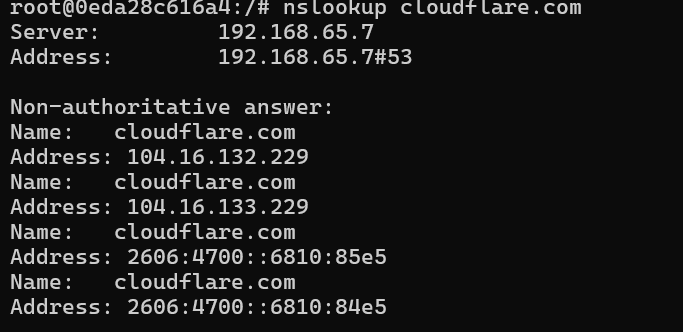
    
 So the public IP addresses of cloudflare.com are:

 IPv4 addresses:

 104.16.132.229 &&
 104.16.133.229


 IPv6 addresses:

 2606:4700::6810:85e5 &&
 2606:4700::6810:84e5

 - #### Map IP address 8.8.8.8 to hostname google-dns

 I opened the /etc/hosts file for editing and I added the following line at the end of the file:
 ```
 8.8.8.8 google-dns
 ```
 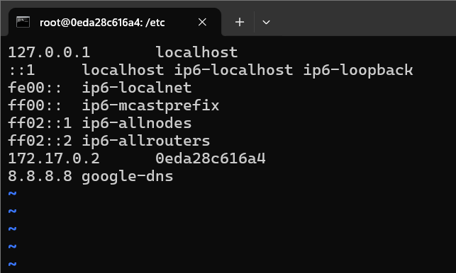
 
 To check if the mapping works, I used the ping command to verify that the IP 8.8.8.8 resolves to google-dns.

 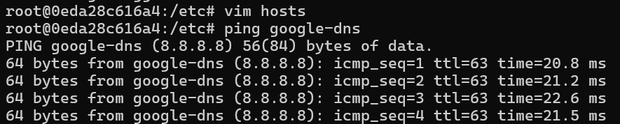
 This confirms that the IP address 8.8.8.8 is correctly mapped to the hostname google-dns
 
 - #### Check if the DNS Port is Open for google-dns

 First, I installed nmap using the following command:
 ```
 apt install -y nmap
```
 Then, I used the nmap command to scan port 53 on 8.8.8.8
```
nmap google-dns
```
 Output:
 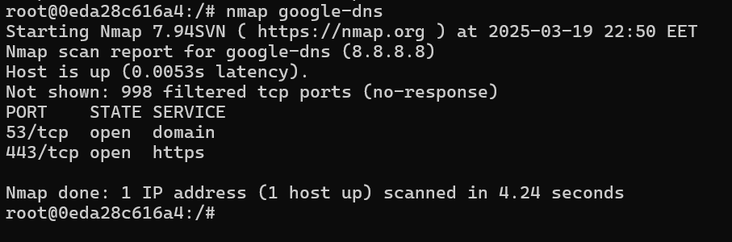

 The output 53/tcp open domain confirms that port 53 is open on 8.8.8.8, which is the default port for DNS queries. 
 Additionally, the output shows that port 443/tcp open https is also open.
 
 - #### Modify the System to Use Google’s Public DNS  
    - Change the nameserver to 8.8.8.8 instead of the default local configuration.  
    - Perform another public IP lookup for cloudflare.com and compare the results.

 To change the nameserver from the default local configuration to Google's DNS (8.8.8.8), I edited the file:
 ```
 /etc/resolv.conf
 ```

 Then, I modified the content of the file to set the nameserver to 8.8.8.8

 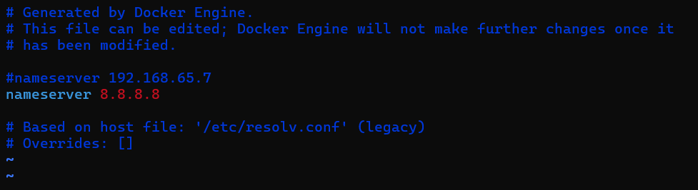
 After modifying the DNS settings, I used nslookup again to perform a public IP lookup for cloudflare.com to compare the results:

 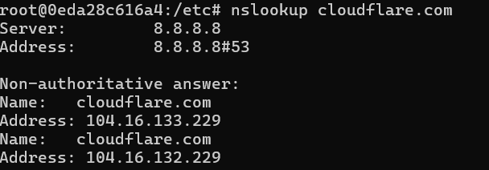
 After updating the /etc/resolv.conf file, the system now uses Google’s Public DNS (8.8.8.8) to handle DNS queries.
 The public IP addresses for cloudflare.com returned the same results as before which is expected because the IP addresses of websites like cloudflare.com are fixed and do not change based on the DNS server being used.

 - #### Install and verify that Nginx service is running  
 I installed Nginx with this command:
 ```
 apt install -y nginx
 ```
I ran the command ``` service nginx start ``` to start the Nginx service. After that, I checked its status using the command ```service nginx status```. This confirmed that the Nginx service is active and running, indicating that Nginx is functioning correctly. 

 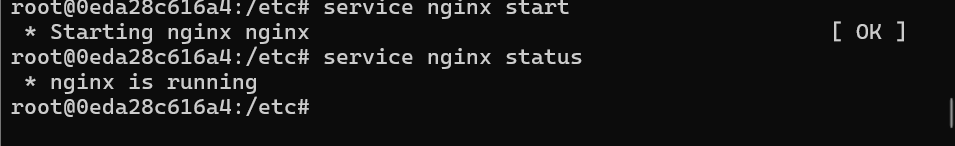
 
 - #### Find the Listening Port for Nginx 

 I accessed the Nginx configuration file who shows that Nginx is listening on port 80 by default:
 ```
 cat /etc/nginx/sites-available/default
 ```
 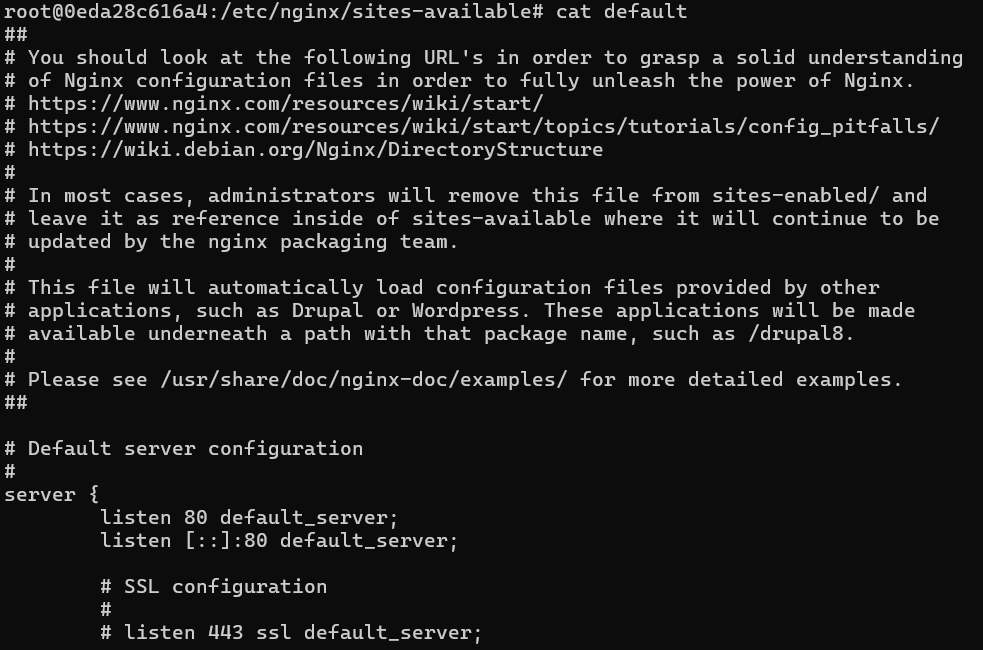

 - #### Change the Nginx Listening port to 8080  
 - #### Modify the default HTML page title from: "Welcome to nginx!" → "I have completed the Linux part of the DevOps internship project"
 I changed the port from 80 to 8080 in the default file with the ``` vim ``` command.
 
 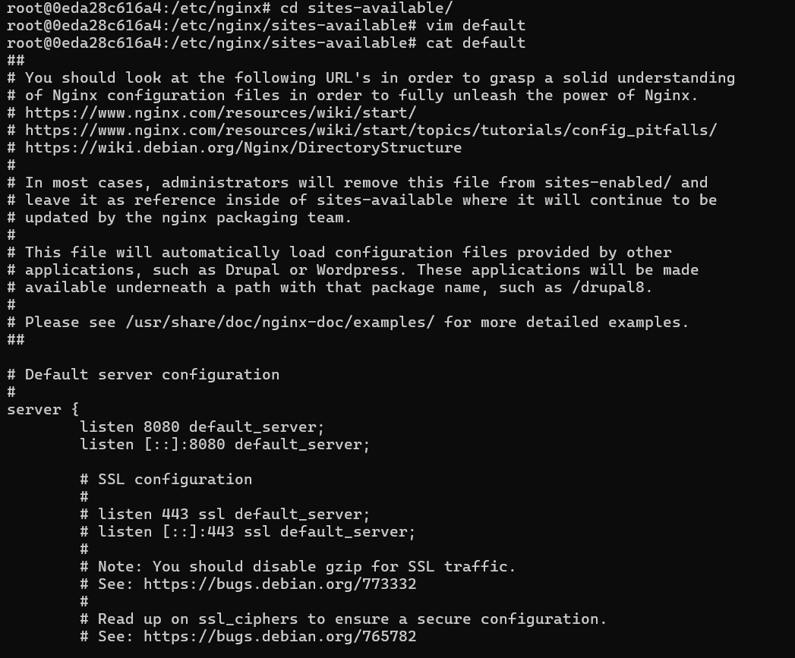

 Then I opened the default Nginx HTML file and changed the title tag from: "Welcome to nginx!" to "I have completed the Linux part of the DevOps internship project"
 and I also restarted the Nginx:
 ```
 service nginx restart
 ``` 
 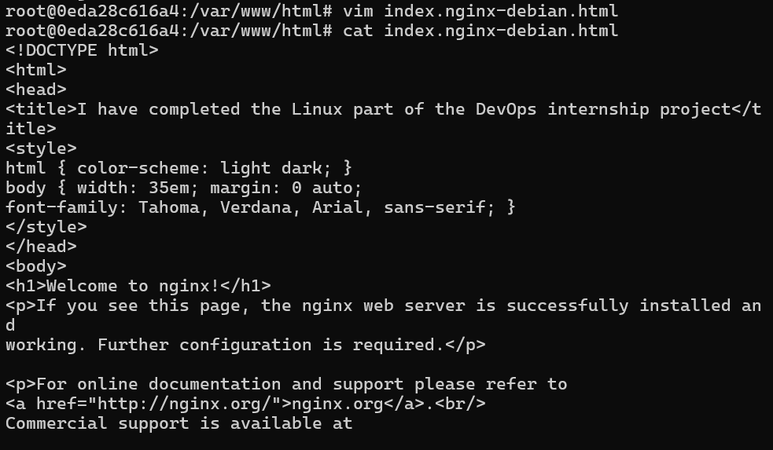
 I noticed that I couldn't access the open port of Nginx from the localhost because the container doesn't have any exposed ports. To validate the changes, I created a new container, exposed port 8080 to port 80 on the host, then made the changes and accessed localhost:80 to view the result.
 
 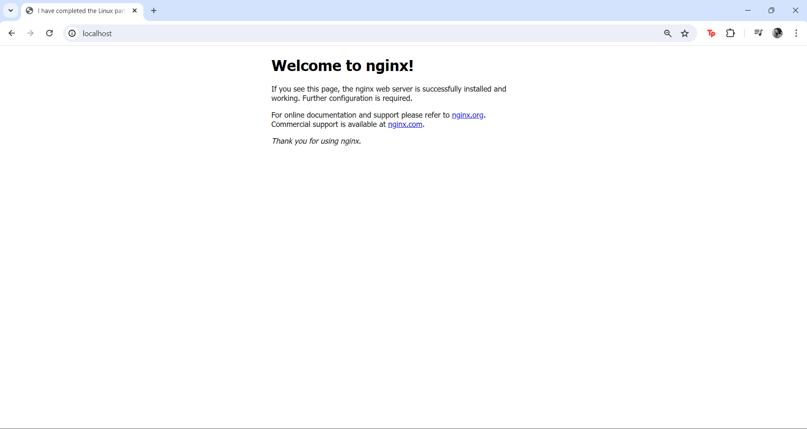