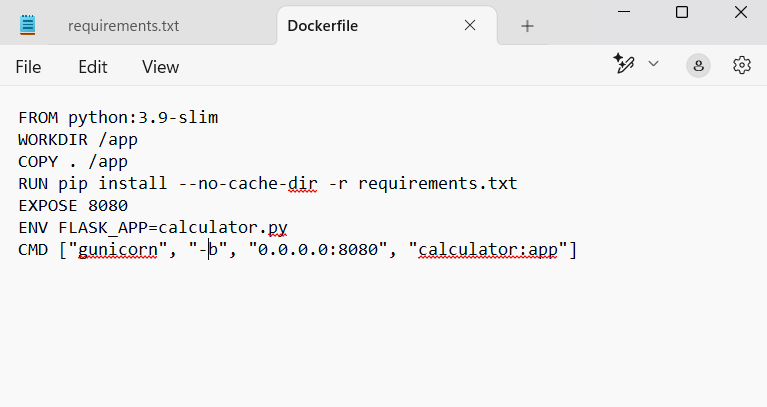

 ## II. Choose one of the applications in the folder. Containerize it with Docker and automate the build and push processes.  

 I chose the Python application calculator.py with the dependencies in the requirements.txt file.
 I created a Dockerfile to containerize the application, set up the environment for Python and installed the necessary dependencies.
 I specified the FLASK_APP environment variable to point to the correct application file
 and installed all the dependencies listed in the requirements.txt file.

 

 I also included Flask==2.0.3 in requirements.txt

 

 After creating the Dockerfile, I built the Docker image using the following command:
 ```
 docker build -t flask-calculator .
 ```
 Once the image was built, I ran the container and mapped port 8080 of the container to port 8080 on the host machine using the command:
 ```
 docker run -p 8080:8080 flask-calculator
 ```
 I accessed the application through the browser: 
 ```
 http://localhost:8080
 ```
 

 I also tested the functionality of the application by entering the numbers separated by commas as specified, and selected the desired operation.

 

 
 
 
 The application returned the correct result for both operations.

 ### Creating a repository for my image.
 I made a tag for my image and pushed it to my public repository.

 

 https://hub.docker.com/repository/docker/mirela236/flask-calculator/tags

 docker pull mirela236/flask-calculator:latest

 ### Automation: 
 First I created an Access Token on dockerhub then I added my access token to my GitHub repository : I created a new repository secret with the name: ```DOCKERHUB_TOKEN``` and another one ```DOCKERHUB_USERNAME```.
 After I created a new action : ```blank.yml```.
   
 
 ```on:
  push:
      branches: [ "main", "master" ]
 ```
 This node sets the action to be triggerd only when I push changes on the main or master branch , it applies only for main as I don`t have a master branch. 
 ```
 build:

        runs-on: ubuntu-latest

        steps:
        - name: Check out the repo
          uses: actions/checkout@v4

        - name: Login to dockerhub
          uses: docker/login-action@v3
          with:
            username: ${{ secrets.DOCKERHUB_USERNAME }}
            password: ${{ secrets.DOCKERHUB_TOKEN }}
       
        - name: Extract short commit hash
          run: echo "SHORT_SHA=$(git rev-parse --short HEAD)" >> $GITHUB_ENV

        - name: Build and push to dockerhub
          uses: docker/build-push-action@v5
          with:
            context: './task2'
            push: true
            tags: ${{ secrets.DOCKERHUB_USERNAME }}/flask-calculator:latest, ${{ secrets.DOCKERHUB_USERNAME }}/flask-calculator:${{ env.SHORT_SHA }}
 
 ```
 In this node I defined my only job which is named build. The build job has the folowing steps:

 - Checking out the repository
 - Loging into dockerhub using the secrets I set up previously(this configures environment variables for sensitive information)
 - Getting the commit hash through a git command and storing it 
 -Building the image and pushing it to the dockerhub repository with the tag from the commit hash saved previously and also with the latest tag making sure that the last image pushed will be pullled when you use the latest tag

 #### Ensure the application catches the Docker container's stop signal and performs a clean shutdown    

 To ensure the application properly handles the Docker container’s stop signal and performs a clean shutdown, I modified the calculator.py file by adding signal handling.
 ```
 import signal
 import sys
 def handle_shutdown(signum, frame):
    print("Received shutdown signal. Cleaning up...")
    sys.exit(0)
 signal.signal(signal.SIGTERM, handle_shutdown)
 signal.signal(signal.SIGINT, handle_shutdown)
 ```
 The function handle_shutdown makes the application terminates when the container stops.
 I used the SIGTERM and SIGINT signals to be sent. 
 To test the implmentation I ran from anoher terminal the command: 
 ```
 docker stop 8967e1a9187bbd2d498161a10e99ca2890c6ccf68b4e31a005fd80ff55b761c08967e1a9187bbd2d498161a10e99ca2890c6ccf68b4e31a005fd80ff55b761c0
 ```
 
 I got the wanted response.
 
