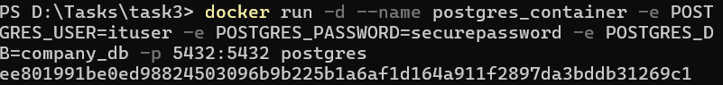
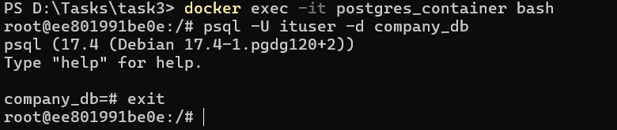
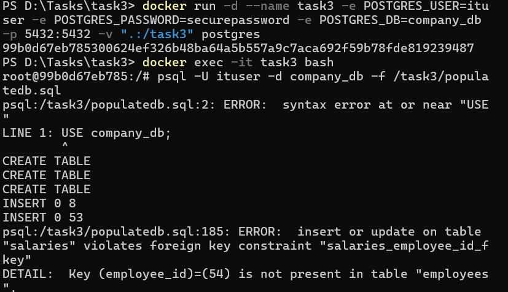
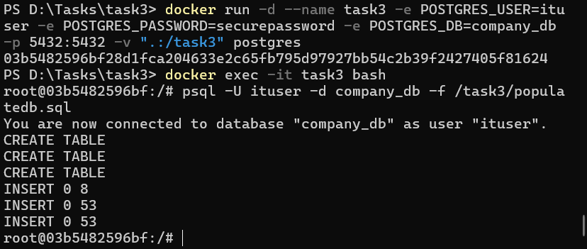
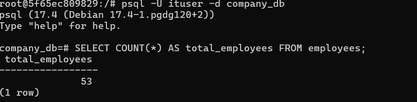
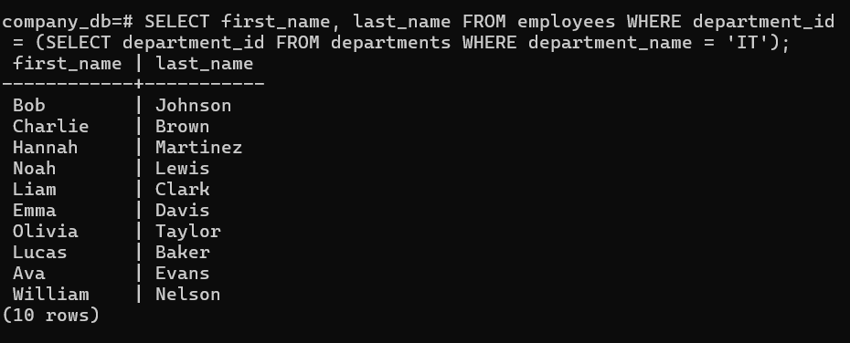
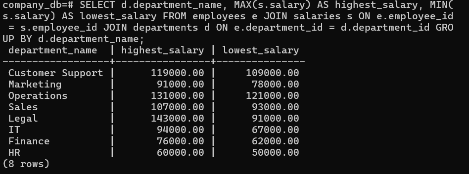
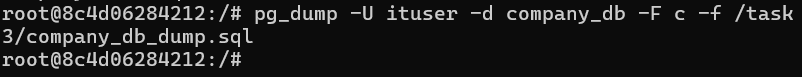

## II. PostgreSQL Container with Data Import and Queries
 With the following command I pulled and ran a PostgreSQL container, creating a database called "company_db" with a custom user "ituser" instead of the default one:
 ```
 docker run -d --name postgres_container -e POSTGRES_USER=ituser -e POSTGRES_PASSWORD=securepassword -e POSTGRES_DB=company_db -p 5432:5432 postgres
 ```

 
 


  - Create a dataset using the sql script provided in the folder 3-db/ 
 
 I noticed that I can`t access the populatedb.sql because it was not present in my container so I created a new container where I mounted my current directory into the /task3 folder inside the container, also creating a  persistent volume to store my data. While executed the ```populatedb.sql``` file I noticed the following errors:
   
    - USE is not compatible with PostgreSQL so I recplaced with \c
    - There are only 53 employees but there are 76 Salaries so I deleted the extra rows

 

 After I made the modifications I started again and got the following result.

 

 #### To Find the total number of employees :

 

 #### Retrieve the names of employees in a specific department
 

 #### Calculate the highest and lowest salaries per department.
 

 #### Dump the dataset into a file. 
 I used the ```pg_dump ``` command to dump the data into company_db_dump.sql file

 

 #### Bash script.sh
 In the first part I defined the variables for the container name , databse name, user credentials, dataset file and log file. 

 In the second part I created the Database and the Admin user: ```admin_cee``` . Then I had to copy the dump inside the container. I executed the three scripts for the total employees, employees in IT and salaries per Department and in the final part I saved the results into a log file : ``` query_results.log```


